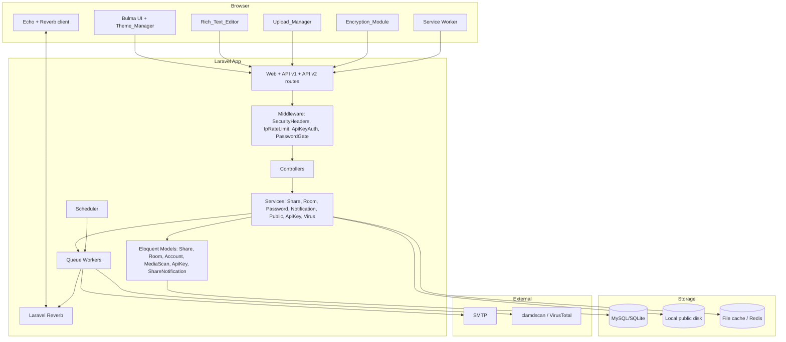
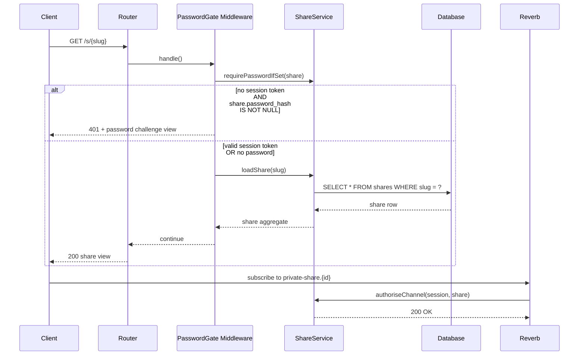
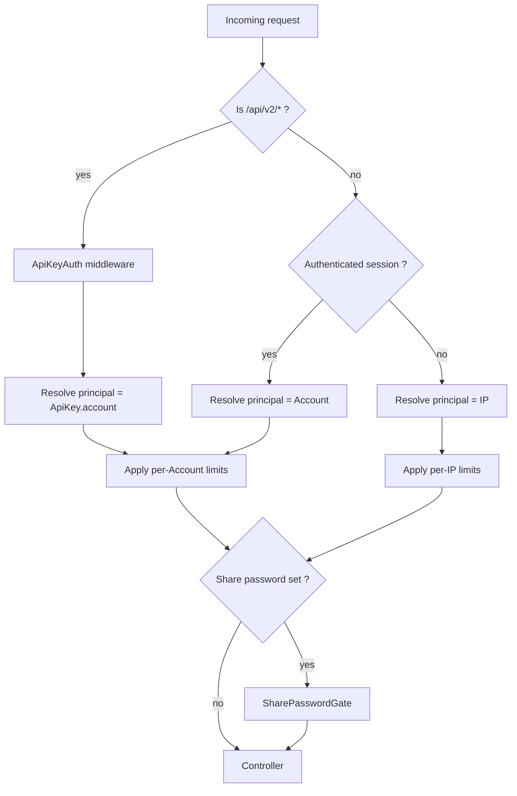
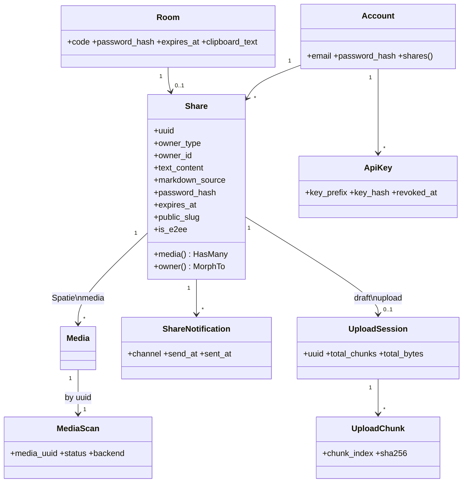

# Design Document

## Overview

This design covers a bundle of twenty enhancements layered onto the existing **AirToShareA** Laravel 12 application. The current codebase is a thin, IP-keyed sharing service: `SharedText` rows hold per-IP plaintext, and `MediaFile` rows act as containers for Spatie Media Library files. The application has no notion of identity beyond `request->ip()`, no broadcasting, no encryption, and no scanning pipeline.

The enhancements introduce three new structural concerns that ripple through every requirement:

1. **A unified `Share` aggregate.** Today, "sharing" is split across two unrelated tables (`shared_texts`, `media_files`) keyed only by IP. To support password protection, custom expiry, public slugs, room codes, accounts, encryption, and broadcasting, every piece of content must hang off a single owner-bearing record. We introduce a `shares` table that owns text and media, with a polymorphic `owner` (IP / Room / Account).
2. **A pluggable owner model.** Requirements 7, 16, and 18 introduce Room and Account owners alongside the existing IP owner. The application must resolve "who owns this share" consistently for authorization, limits, and visibility.
3. **An asynchronous worker pipeline.** Requirements 9 (chunk assembly), 11 (notifications), 14 (broadcasting), and 20 (virus scanning) all require background work driven by Laravel's queue and scheduler. We standardise on the existing `database` queue with the option to switch to Redis once Reverb is in play.

The design is incremental: every existing endpoint continues to work for guest IP users (Requirement 16.13). New behaviour is opt-in.

### Design Decisions and Rationales

| Decision | Rationale |
|---|---|
| Introduce a `shares` table rather than extending `shared_texts` | The existing schema cannot represent multi-owner sharing or non-IP ownership without breaking guest-flow invariants. A new aggregate is cheaper than retrofitting two unrelated tables. |
| Use polymorphic `owner_type` / `owner_id` | Cleanest way to support IP, Room, and Account owners with one query path; matches Laravel idioms. |
| Use `bacon/bacon-qr-code` for QR generation | Pure-PHP, no GD/Imagick fork, well-maintained, MIT, already a Laravel community staple. |
| Use `league/commonmark` for Markdown rendering | CommonMark-compliant, used by Laravel's own docs renderer, supports a HTML sanitizer extension. |
| Use Laravel Reverb for WebSockets | First-party, already runs over Laravel's broadcasting abstraction, no third-party billing. |
| Use ClamAV via `clamdscan` (with VirusTotal as alternative) | ClamAV runs locally without per-request cost. VirusTotal is offered as an alternative for environments without local ClamAV. |
| Use Workbox-style hand-written service worker | The PWA scope is small (one app shell). Workbox would be over-engineered. |
| Store E2EE key only in URL fragment | Browsers do not transmit fragments; this is the standard E2EE pattern (Bitwarden Send, Firefox Send). |

## Architecture

### High-level Architecture



### Request Lifecycle for a Protected Share



### Module Boundaries

The application is organised as follows. New code lives next to existing code following Laravel conventions (no architectural overhaul):

```
app/
  Http/
    Controllers/
      ShareController.php               (existing, refactored to use ShareService)
      MediaController.php               (existing, refactored to use ChunkedUploadService)
      RoomController.php                (NEW)
      AuthController.php                (NEW - account login/register)
      AccountController.php             (NEW - my-shares, favourites, deletion)
      Api/V2/{Share,Media,ApiKey}Controller.php (NEW)
      PublicShareController.php         (NEW)
      ChunkedUploadController.php       (NEW)
      QrCodeController.php              (NEW)
      ManifestController.php            (NEW)
    Middleware/
      ApiKeyAuth.php                    (NEW)
      SharePasswordGate.php             (NEW)
      RoomCodeRateLimit.php             (NEW)
      PasswordVerifyRateLimit.php       (NEW)
  Models/
    Share.php                           (NEW - aggregate)
    Room.php                            (NEW)
    Account.php                         (NEW)
    ApiKey.php                          (NEW)
    MediaScan.php                       (NEW)
    ShareNotification.php               (NEW)
    UploadSession.php                   (NEW)
    UploadChunk.php                     (NEW)
    MediaFile.php                       (existing - kept for guest IP backward compat)
    SharedText.php                      (existing - kept for guest IP backward compat)
  Services/
    ShareService.php                    (NEW)
    PasswordManager.php                 (NEW)
    ExpiryManager.php                   (NEW)
    QrGenerator.php                     (NEW)
    RoomService.php                     (NEW)
    ChunkedUploadService.php            (NEW)
    NotificationService.php             (NEW)
    ClipboardSyncService.php            (NEW)
    PublicGalleryService.php            (NEW)
    ApiKeyService.php                   (NEW)
    VirusScanner.php                    (NEW)
    MarkdownRenderer.php                (NEW)
  Events/
    MediaAdded.php                      (NEW - broadcasts on private-share.{id})
    MediaDeleted.php                    (NEW)
    TextUpdated.php                     (NEW)
    ClipboardUpdated.php                (NEW - broadcasts on private-room.{id}.clipboard)
  Jobs/
    AssembleChunkedUpload.php           (NEW)
    ScanMediaForViruses.php             (NEW)
    SendExpiryReminder.php              (NEW)
    DeleteInfectedMedia.php             (NEW)
    CleanupExpiredUploadSessions.php    (NEW)
  Console/Commands/
    ShareCleanupExpired.php             (NEW - replaces existing per-table cleanups)
    ScheduleExpiryReminders.php         (NEW)
public/
  sw.js                                 (NEW)
  manifest.webmanifest                  (NEW)
  assets/js/
    theme-manager.js                    (NEW)
    upload-manager.js                   (NEW)
    rich-text-editor.js                 (NEW)
    encryption-module.js                (NEW)
    preview-renderer.js                 (NEW)
    realtime.js                         (NEW)
    clipboard.js                        (NEW)
```

### Authentication and Authorisation Layers

Three independent authentication facets coexist on every request:

1. **Account session** (cookie-based, Laravel `web` guard): identifies the Account principal. Optional. Drives Requirements 16, 18 admin actions.
2. **Share password session** (per-share signed token in session): proves a request has passed `bcrypt::check` for a specific share. Required by Requirements 2, 7, 14.6, 17.3.
3. **API key bearer token** (`Authorization: Bearer ...` on `/api/v2/*`): identifies an Account programmatically. Required by Requirement 18.

Authorisation order:



## Components and Interfaces

### 1. QR_Generator (Requirement 1)

- **Library**: `bacon/bacon-qr-code` (composer install).
- **Service**: `App\Services\QrGenerator`
  - `generate(string $url): string` returns PNG bytes; minimum 200x200 px (configured `--size 240` to give comfortable margin).
  - `generateOrFail(string $url): string` throws `QrGenerationException` on failure; caller catches, logs `share_id + reason`, and renders fallback.
- **Controller**: `QrCodeController@show($slug)` returns `image/png` body with `Content-Disposition: attachment; filename="share-{slug}.png"` when `?download=1`, otherwise inline.
- **Frontend**: Share view contains `` plus a click handler to navigate to `?download=1`. On image `error`, the fallback URL text and an error banner are shown.

### 2. Password_Manager (Requirement 2)

- **Service**: `App\Services\PasswordManager`
  - `hash(string $plain): string` calls `Hash::make($plain)` (bcrypt, default cost 10 for share passwords; cost 12 for accounts per Requirement 16.2).
  - `verify(string $plain, string $hash): bool`.
  - `validate(string $plain): void` enforces length 6..128, throws `ValidationException` otherwise.
- **Storage**: `shares.password_hash` (nullable). Plain text never persisted; logs scrubbed of `password` keys via Laravel `log_levels` and a custom processor that redacts the `password` field in any context array.
- **Middleware**: `SharePasswordGate` consults a per-session map `session('share_pw_ok')[$shareId] === true`. On absent or false, returns 401 with a JSON `{status:"error", message:"Password required"}` for API or a password challenge HTML for web.
- **Brute-force protection**: `PasswordVerifyRateLimit` middleware uses Laravel `RateLimiter::for('share-pw')` keyed by `ip|share_id`. After 5 failures in 15 minutes, blocks for 15 minutes returning 401 without invoking bcrypt.

### 3. Expiry_Manager (Requirement 3)

- **Service**: `App\Services\ExpiryManager`
  - `parseOption(?string $opt): Carbon` accepts `"1h" | "6h" | "24h" | "7d"`, defaults to `24h`. Returns absolute UTC timestamp.
  - `enforceOnRead(Share $s): void` deletes share + media if expired and throws `ShareExpiredException` (caller maps to HTTP 404).
- **Validation**: Form Request rule `Rule::in(['1h','6h','24h','7d'])`. Required for Account owners' values which extend up to 30 days (Requirement 16.9): `Rule::in(['1h','6h','24h','7d','30d'])` when authenticated.
- **Scheduled cleanup**: `App\Console\Commands\ShareCleanupExpired` registered in `Console\Kernel::schedule()` as `->hourly()`. Deletes shares whose `expires_at < now()->subHour()` (i.e. more than 1 hour past expiry).
- **On-read fallback**: every read path through `ShareService::loadShare()` checks expiry first, deletes the share + media before throwing 404.

### 4. Theme_Manager (Requirement 4)

- **Frontend only** (`public/assets/js/theme-manager.js`). Loaded synchronously in `<head>` from a small inline bootstrap to avoid FOUC:

```html
<script>
(function(){
  try {
    var k='airtoshare_theme';
    var stored=localStorage.getItem(k);
    var theme;
    if (stored==='light'||stored==='dark') theme=stored;
    else if (window.matchMedia&&window.matchMedia('(prefers-color-scheme: dark)').matches) theme='dark';
    else theme='light';
    document.documentElement.dataset.theme=theme;
    if (stored && stored!==theme) localStorage.setItem(k,theme);
  } catch(e){ document.documentElement.dataset.theme='light'; }
})();
</script>
```

- The full controller is loaded later and binds the toggle button.
- Dark theme is implemented as `[data-theme="dark"]` CSS overrides in `custom.css`, ensuring WCAG AA contrast for body, links, and form fields. A build-time accessibility check (`pa11y` or `axe-core` CLI) gates the dark theme palette.
- Runtime fallback: a small contrast self-check on first paint sets `localStorage.airtoshare_dark_disabled = "1"` if any sampled text element has computed contrast below the threshold; the toggle reads this flag and disables the dark option.

### 5. Clipboard_Component (Requirement 5)

- **Frontend only** (`public/assets/js/clipboard.js`). Implements a tri-strategy chain: `navigator.clipboard.writeText` → hidden `<textarea>` + `document.execCommand('copy')` → user-dismissable error banner. The button is disabled while a copy is in flight; success indicator uses a `confirm-2s` CSS class with a `setTimeout(remove, 2500)`.

### 6. Preview_Renderer (Requirement 6)

- **Frontend only** (`public/assets/js/preview-renderer.js`). Uses `IntersectionObserver` to lazy-load:
  - `image/*` ≤ 25 MB → `` with `loading="lazy"`.
  - `application/pdf` ≤ 25 MB → `<iframe>` pointing at PDF.js CDN viewer (or local copy under `public/assets/pdfjs/`) which supplies prev/next/page-number controls.
  - `video/*` ≤ 200 MB → `<video controls preload="metadata">`.
- A separate `IntersectionObserver` with `rootMargin: '0px'` plus a 5-second debounce releases preview elements (``, `video.pause()`, iframe `src=""`) once they have been outside the viewport for ≥5 s.
- Load-error handling: a `setTimeout` of 10 s plus listening for `error` events on `` / `<video>` / `<iframe>` triggers a retry control. The download button is rendered independently in markup so it is always available.

### 7. Room_Service (Requirement 7)

- **Service**: `App\Services\RoomService`
  - `create(?string $expiry, ?string $password): Room` generates a 6-character code from the alphabet `ABCDEFGHJKLMNPQRSTUVWXYZ23456789` (32 characters; excludes `O`, `I`, `0`, `1`). Up to 5 retries on uniqueness collision; throws `RoomAllocationException` after that.
  - `findByCode(string $code): ?Room` does `Room::whereRaw('UPPER(code) = ?', [strtoupper($code)])->where('expires_at', '>', now())->first()`.
  - `validateFormat(string $code): bool` verifies regex `/^[A-Z2-9&&[^OI]]{6}$/i` (length 6, alphabet enforcement).
- **Controller**: `RoomController@store` (create), `RoomController@show` (join via code).
- **Rate limit**: `RoomCodeRateLimit` middleware records each invalid submission in cache key `room_invalid:{ip}`. After 10 invalid submissions in 60 s, blocks the IP for 5 minutes returning 429.
- **Room expiry & cleanup**: `rooms.expires_at` enforced by the same scheduled `ShareCleanupExpired` command, with a presence check: a room is deleted only when `expires_at <= now()` AND `last_activity_at <= now()->subSeconds(60)`. `last_activity_at` is updated by Reverb presence channel events.

### 8. Upload_Manager (Requirement 8)

- **Frontend** (`public/assets/js/upload-manager.js`). State machine per file: `queued → uploading → succeeded | failed | exhausted`. Each row carries its own `XMLHttpRequest` so progress events are independent. Updates the DOM at most every 250 ms via `requestAnimationFrame` throttle. Failed rows expose Retry; after 3 retries the button is disabled. Final summary line is computed when the queue is drained.

### 9. Chunked_Upload_Service (Requirement 9)

- **Service**: `App\Services\ChunkedUploadService`
  - `start(int $totalChunks, int $totalBytes, string $filename, string $mime, ?string $shareId): UploadSession`
  - `receiveChunk(UploadSession $s, int $idx, UploadedFile $chunk, string $clientHash): UploadChunk`
  - `status(UploadSession $s): array` returns received indexes.
  - `assemble(UploadSession $s): Media` concatenates `0..N-1` and registers the result via Spatie Media Library on the share.
- **Storage**: chunks stored under `storage/app/chunks/{session_uuid}/{index}.bin`. Hashes computed with SHA-256.
- **Validation**: chunk size ≤ 5 MB, total chunks 1..1000, declared total bytes ≤ 500 MB. Out-of-range index → 422.
- **Idempotency**: re-uploading the same `(session, index)` with a matching hash is a no-op success; mismatched hash → 409 with `integrity_failed` code.
- **Cleanup**: `CleanupExpiredUploadSessions` job runs hourly, deletes sessions whose first-chunk timestamp is older than 24 hours and which are not yet completed.

### 10. Clipboard_Sync_Service (Requirement 10)

- **Service**: `App\Services\ClipboardSyncService`
  - `update(Room $r, string $text): void` rejects > 500,000 chars, persists `rooms.clipboard_text` + `rooms.clipboard_updated_at`, and broadcasts `ClipboardUpdated` on `private-room.{id}.clipboard`.
  - Uses an SQL `UPDATE ... WHERE clipboard_updated_at < :ts` to enforce last-write-wins; the loser is silently dropped.
- **Channel auth**: `routes/channels.php` registers `private-room.{id}.clipboard` with a callback that asserts the session's `room_join` token matches and (if the room is password-protected) the `share_pw_ok[$shareId]` flag is true.
- **Disconnection**: Reverb presence channel `presence-room.{id}` updates `last_seen_at` per device; a periodic job (every 30 s) marks devices whose `last_seen_at < now()->subSeconds(30)` as departed and drops their channel subscription.
- **Retries**: the `ClipboardUpdated` event is dispatched via `ShouldBroadcastNow` and wrapped in a job with `tries=3`, `backoff=1`. After 3 failures the device is added to `room.out_of_sync_devices` for that update.

### 11. Notification_Service (Requirement 11)

- **Service**: `App\Services\NotificationService`
  - `arm(Share $s): void` stores planned reminders in `share_notifications` (one row per channel per cycle). Cycle id = the share's current `expires_at` value.
  - `cancelFor(Share $s): void` deletes pending rows on share deletion.
- **Worker**: `ScheduleExpiryReminders` console command runs every minute. It selects `share_notifications` rows where `send_at BETWEEN now() AND now()->addSeconds(60)` and dispatches `SendExpiryReminder` jobs.
- **Channels**:
  - **Browser**: a Web Push subscription is stored on the share owner side (Account or browser-stored opt-in for IP). On send, the worker calls a tiny push gateway. (For IP-only owners without an account, the reminder is delivered as a `private-ip.{ip}` Reverb broadcast that the user's open tab consumes.)
  - **Email**: Laravel `Mail::to(email)->send(new ShareExpiryReminder($share))`.
- **Once-per-cycle**: `share_notifications.sent_at` is set to the actual send time on success or terminal failure (per Requirement 11.7).
- **Retry**: Laravel queue retries are disabled for `SendExpiryReminder`; the service records the failure, schedules a single retry job 5..6 minutes later, and on second failure marks the row as sent.

### 12. Rich_Text_Editor (Requirement 12)

- **Frontend** (`public/assets/js/rich-text-editor.js`): a small editor wrapping a `<textarea>` with toolbar buttons that dispatch wrap/insert operations. Live preview is rendered in-browser via `marked` (CDN-pinned version) for the typing experience; the *server* re-renders on save using `league/commonmark`.
- **Server**: `App\Services\MarkdownRenderer`
  - `render(string $markdown): string` uses CommonMark with the `HtmlFilter` extension and the `HTMLPurifier`-style allowlist tuned to Bulma. Strips `<script>`, `<iframe>`, `<object>`, `<embed>`, and any `on*` attributes.
- **Validation**: `markdown_source` ≤ 500,000 chars; `Validator::make` Form Request rule. Rejection past the limit triggers a 422 with `length_exceeded`.
- **Paste handling**: editor listens to `paste` events, reads `text/html` and converts via Turndown (CDN), falling back to `text/plain` if HTML is absent.

### 13. Increased Limits (Requirement 13)

- Configuration in `config/airtoshare.php`:
  - `legacy_upload_max_bytes` = 25 * 1024 * 1024 (25 MB).
  - `chunked_upload_max_bytes` = 500 * 1024 * 1024 (500 MB).
  - `active_files_limit_ip` = 50.
  - `active_files_limit_account` = 100.
  - `account_storage_limit_bytes` = 1024 * 1024 * 1024.
  - `account_max_expiry_option` = `30d`.
- Limits are enforced in `ShareService::canAddFile()` and presented via a `GET /api/v1/limits` endpoint consumed by the upload page.

### 14. Realtime_Broadcaster (Requirement 14)

- **Reverb**: configured in `config/reverb.php`. Channels:
  - `private-share.{shareId}`: events `media.added`, `media.deleted`, `text.updated`.
  - `presence-share.{shareId}`: tracks viewers (used by Public Gallery counters & moderation hooks).
  - `private-room.{roomId}.clipboard`: clipboard sync.
- **Authorisation** (`routes/channels.php`): for each `private-share.{id}` join, the closure checks (a) the share exists, (b) if `password_hash` is set, the session has the `share_pw_ok[id]` flag.
- **Outgoing message guard**: `BroadcastingMiddleware` wraps each event so that if the share is password-protected and any subscriber's `share_pw_ok` flag has been revoked, the message is dropped for them.
- **Frontend reconnection** (`public/assets/js/realtime.js`): exponential backoff 1 → 2 → 4 → 8 → 16 → 30 s capped, max 10 attempts. After exhaustion shows a banner "Real-time updates unavailable". On reconnect, calls `GET /api/v1/shares/{id}/state` and replaces the local view.

### 15. Encryption_Module (Requirement 15)

- **Frontend** (`public/assets/js/encryption-module.js`): uses Web Crypto API (`AES-GCM`, 256-bit, 96-bit IV from `crypto.getRandomValues`). Key is base64url-encoded into the URL fragment after share creation: `https://example.test/s/abc#k=BASE64URL_KEY`.
- **Upload**: file is encrypted in chunks of 5 MB pre-chunking, then handed to the existing `ChunkedUploadService`. Server stores ciphertext as opaque bytes.
- **Decryption**: recipient's tab parses `location.hash`, verifies key length, decrypts the response body. Decryption failures result in plaintext being immediately overwritten in memory and never rendered.
- **Server constraints**:
  - `e2ee = true` shares carry the additional fields `iv` and `auth_tag` per media row.
  - Submission validation rejects any field named `key`, `e2ee_key`, or similar.
  - `Log` extends Laravel's logger with a processor that strips `#fragment` tokens from any URL captured in context (defense in depth - browsers should not forward fragments anyway).
  - Virus scanning is suppressed for `e2ee = true` shares; the share view shows a "not scanned" notice.
  - The Preview_Renderer detects `e2ee = true` and uses local decryption + blob URLs instead of server URLs.

### 16. Account_Service (Requirement 16)

- **Models**: `Account` (Laravel `Authenticatable`) backed by a new `accounts` table. Existing `users` table is renamed via migration to avoid confusion.
- **Endpoints**: `/auth/register`, `/auth/login`, `/auth/logout`, `/account` (delete), `/account/shares` (list), `/account/shares/{id}/favourite`.
- **Limits**: enforced in `ShareService` based on principal resolution; favourites stored in `account_favourites` (composite unique key (account_id, share_id), max 50 enforced at write time).
- **Backward compat**: guest IP flow remains the default; the only added requirement on existing routes is principal resolution returning IP when no session is present.

### 17. Public_Gallery (Requirement 17)

- **Service**: `App\Services\PublicGalleryService`
  - `enable(Share $s): string` generates a 12-char URL-safe slug, retries on collision (max 5).
  - `disable(Share $s): void` clears `public_slug` and increments `public_invalidation_revision`.
- **Routing**: `Route::get('/p/{slug}', [PublicShareController::class, 'show'])`. The controller looks up by slug, applies password rules if any, sets `X-Robots-Tag: noindex, nofollow`, increments `shares.public_view_count`.
- **Cache**: a `public:slug:{slug}` cache entry holds either the share id or a tombstone. On disable, the tombstone is set with TTL 60 s (Requirement 17.6).
- **No indexing**: explicitly excluded from `SitemapController`. Robots header set unconditionally.

### 18. API_Service (Requirement 18)

- **Routes**: `/api/v2/*` group with `ApiKeyAuth` middleware and Laravel's `RateLimiter::for('api-v2')` set to 60 per 60-second window keyed by `apikey:{id}`.
- **Endpoints**:
  - `POST /api/v2/shares`
  - `GET  /api/v2/shares` (list active)
  - `GET  /api/v2/shares/{id}`
  - `POST /api/v2/shares/{id}/media` (legacy single-request)
  - `POST /api/v2/shares/{id}/chunked-upload/start|chunk|complete`
  - `DELETE /api/v2/shares/{id}/media/{uuid}`
  - `POST /api/v2/api-keys` (account-session only, not via API key)
  - `DELETE /api/v2/api-keys/{id}` (revoke)
- **Auth flow**: `ApiKeyAuth` parses `Authorization: Bearer {key}`, looks up by `key_prefix` (first 8 chars stored unhashed for indexing), then `Hash::check($plain, $row->key_hash)`. On match and `revoked_at IS NULL`, the request is bound to the owning Account.
- **Response shape**: a `JsonResponse` macro `apiOk($data)` and `apiError($message, $errors=[])` standardises `{status:"success"|"error", ...}`.
- **Documentation**: a Markdown file at `resources/docs/api-v2.md` rendered by `DocsController@show` at `/docs/api`. No auth required.

### 19. PWA_Module (Requirement 19)

- **Manifest** served by `ManifestController@show` at `/manifest.webmanifest` with `Content-Type: application/manifest+json`. Includes `name`, `short_name`, `theme_color`, `background_color`, `display: "standalone"`, `start_url: "/"`, and the two existing icons (`/android-chrome-192x192.png`, `/android-chrome-512x512.png`).
- **Service worker** (`public/sw.js`) - hand-written, scope `/`. Strategy:
  - **Pre-cache** on install: `/`, `/assets/css/bulma.min.css`, `/assets/css/custom.min.css`, `/assets/js/app.min.js`, `/manifest.webmanifest`, both icons. Versioned cache name `airtoshare-shell-v{n}`.
  - **Runtime cache exclusion list**: `/api/v1/text`, `/api/v1/media`, `/api/v2/shares*`, `/p/*`, `/download/*` are *never* cached - service worker uses `fetch(event.request)` directly with no `caches.match()` consultation.
  - **Activate**: deletes old `airtoshare-shell-v*` caches atomically.
  - **Update prompt**: client-side `navigator.serviceWorker.addEventListener('controllerchange')` triggers a banner with a Reload button.
- **Offline detection**: window `online` / `offline` events drive a banner element with debounce 2 s.

### 20. Virus_Scanner (Requirement 20)

- **Models**: `media_scans` keyed by `media_id` (Spatie media UUID), columns `status`, `backend`, `retry_count`, `result_payload`, `scanned_at`.
- **Worker**: `ScanMediaForViruses` queued job
  1. If the share is E2EE, skip and mark `skipped_e2ee`.
  2. Otherwise, invoke the configured backend.
  3. ClamAV path: `Process::run("clamdscan --no-summary {$path}")`. Exit 0 = clean, exit 1 = infected, other = error.
  4. VirusTotal path: compute SHA-256 once, query `/api/v3/files/{hash}`, count `last_analysis_stats.malicious`. ≥ 2 = infected.
  5. On clean → `status=clean`. On infected → `status=infected`, dispatch `DeleteInfectedMedia` (within 5 minutes), notify owner via `NotificationService`.
  6. Transient errors (timeout / 5xx / process failure) → up to 3 retries 30 s apart.
  7. After 5 minutes total without conclusive result → `status=error`, downloads return 503 until manual review.
- **Download gate**: `MediaController::download()` consults `media_scans.status`:
  - `pending` → 425.
  - `clean` → serve.
  - `infected` → 451.
  - `error` → 503.
  - `skipped_e2ee` → serve with the unscanned notice rendered in the surrounding share view.

## Data Models

### shares (NEW)

| Column | Type | Notes |
|---|---|---|
| id | bigint pk | |
| uuid | char(36) unique | external id, used in URLs / events |
| owner_type | string | `ip`, `room`, `account` |
| owner_id | string | IP literal, room id, or account id (string for IP, FK otherwise) |
| text_content | longtext nullable | server-rendered HTML for Markdown shares OR plaintext |
| markdown_source | longtext nullable | for editing; `<= 500,000` chars |
| password_hash | string nullable | bcrypt |
| expires_at | timestamp | UTC, second precision |
| public_slug | char(12) nullable unique | URL-safe alphabet |
| public_view_count | int default 0 | |
| is_e2ee | boolean default false | |
| is_favourite | boolean default false | only meaningful for owner_type=account |
| created_at, updated_at | timestamps | |

Indexes: `(owner_type, owner_id, expires_at)`, `(public_slug)`, `(expires_at)`.

### rooms (NEW)

| Column | Type | Notes |
|---|---|---|
| id | bigint pk | |
| code | char(6) unique | normalised uppercase, alphabet `ABCDEFGHJKLMNPQRSTUVWXYZ23456789` |
| password_hash | string nullable | |
| expires_at | timestamp | |
| last_activity_at | timestamp nullable | |
| clipboard_text | mediumtext nullable | up to 500,000 chars |
| clipboard_updated_at | timestamp nullable | |
| created_at, updated_at | timestamps | |

### accounts (NEW)

| Column | Type | Notes |
|---|---|---|
| id | bigint pk | |
| email | string unique | |
| password_hash | string | bcrypt cost ≥ 12 |
| email_verified_at | timestamp nullable | |
| remember_token | string nullable | |
| created_at, updated_at | timestamps | |

### account_favourites (NEW)

| Column | Type | Notes |
|---|---|---|
| account_id | fk accounts | |
| share_id | fk shares | |
| created_at | timestamp | |

Composite unique `(account_id, share_id)`. Application enforces ≤ 50 per account.

### api_keys (NEW)

| Column | Type | Notes |
|---|---|---|
| id | bigint pk | |
| account_id | fk accounts | |
| name | string | |
| key_prefix | char(8) indexed | first 8 chars of plaintext, stored verbatim for lookup |
| key_hash | string | bcrypt |
| revoked_at | timestamp nullable | |
| last_used_at | timestamp nullable | |
| created_at, updated_at | timestamps | |

### upload_sessions (NEW)

| Column | Type | Notes |
|---|---|---|
| id | bigint pk | |
| uuid | char(36) unique | |
| share_id | fk shares nullable | |
| filename | string | |
| mime | string | |
| total_bytes | bigint | ≤ 500 MB |
| total_chunks | int | 1..1000 |
| first_chunk_at | timestamp nullable | |
| completed_at | timestamp nullable | |
| created_at, updated_at | timestamps | |

### upload_chunks (NEW)

| Column | Type | Notes |
|---|---|---|
| id | bigint pk | |
| session_id | fk upload_sessions | |
| chunk_index | int | |
| sha256 | char(64) | |
| size_bytes | int | ≤ 5 MB |
| stored_path | string | `chunks/{session_uuid}/{index}.bin` |
| created_at | timestamp | |

Composite unique `(session_id, chunk_index)`.

### media_scans (NEW)

| Column | Type | Notes |
|---|---|---|
| id | bigint pk | |
| media_uuid | char(36) unique | references Spatie's `media.uuid` |
| status | string | `pending` \| `clean` \| `infected` \| `error` \| `skipped_e2ee` |
| backend | string | `clamav` \| `virustotal` |
| retry_count | int default 0 | |
| result_payload | json nullable | |
| queued_at | timestamp | |
| scanned_at | timestamp nullable | |

### share_notifications (NEW)

| Column | Type | Notes |
|---|---|---|
| id | bigint pk | |
| share_id | fk shares | |
| cycle_expires_at | timestamp | the share expiry value at arming time |
| channel | string | `browser` \| `email` |
| send_at | timestamp | `cycle_expires_at - 60 minutes` (or `now()` if < 60 min away) |
| sent_at | timestamp nullable | |
| failure_count | int default 0 | |
| created_at | timestamp | |

Composite unique `(share_id, cycle_expires_at, channel)` enforces once-per-cycle.

### media (existing, augmented)

We keep Spatie's `media` table as-is. Added relationship from `media_scans.media_uuid` → `media.uuid`.

### Backward-compat tables

`shared_texts` and `media_files` remain in place; the existing guest IP flow is now a thin adapter that creates a `shares` row with `owner_type='ip'` and synchronises legacy rows for one release cycle, after which a follow-up migration drops them.

### Domain Class Diagram




## Correctness Properties

*A property is a characteristic or behavior that should hold true across all valid executions of a system - essentially, a formal statement about what the system should do. Properties serve as the bridge between human-readable specifications and machine-verifiable correctness guarantees.*

These properties were derived from the prework analysis of every acceptance criterion. Redundant or subsumed criteria have been merged so that each property below provides unique validation value. Criteria classified as `EXAMPLE`, `INTEGRATION`, or `SMOKE` are out of scope here and will be tested as described in the Testing Strategy.

### Property 1: QR code round trip and minimum size

*For any* HTTPS URL of length 1 to 2048 characters, the QR_Generator's output PNG SHALL (a) decode byte-for-byte to the input URL when read by a conformant QR decoder, and (b) have width and height of at least 200 pixels.

**Validates: Requirements 1.1, 1.2, 1.3**

### Property 2: Password hashing round trip with no plaintext leak

*For any* password of length 6 to 128 characters, after saving a Share with that password, (a) `Hash::check(plain, share.password_hash)` returns true, AND (b) the plaintext does not appear in any column of the `shares` row, in any captured log line, or in any other persisted record.

**Validates: Requirements 2.1, 2.5**

### Property 3: Password length validation

*For any* string of length 0..5 or 129..1000, attempting to save a Share with that password SHALL be rejected with a length-violation error and SHALL NOT modify the share's `password_hash` column.

**Validates: Requirements 2.2**

### Property 4: Protected-share access gate

*For any* Share with a non-null `password_hash` and any HTTP request that does not present a verified password session, the response SHALL be HTTP 401 with a body that excludes the share's text content and media URLs.

**Validates: Requirements 2.3, 2.4**

### Property 5: Password verification rate limit

*For any* sequence of password verification attempts originating from a single IP for a single share, the (k+1)th attempt within a rolling 15-minute window SHALL short-circuit with HTTP 401 and SHALL NOT invoke `Hash::check` whenever k >= 5; whenever k < 5 the attempt SHALL invoke `Hash::check` exactly once.

**Validates: Requirements 2.7**

### Property 6: Password removal flips access

*For any* Share that previously had a password, after the owner removes the password and the save completes, every subsequent read SHALL return HTTP 200 with the share content and SHALL NOT return a password challenge.

**Validates: Requirements 2.8**

### Property 7: Expiry option parsing

*For any* expiry option string in `{"1h","6h","24h","7d"}` (or `"30d"` for an account principal), the resulting `expires_at` SHALL equal `now() + duration` to within 1 second of clock skew, stored in UTC with at least second precision.

**Validates: Requirements 3.1, 3.3, 7.5, 16.9**

### Property 8: Invalid expiry option rejection is side-effect free

*For any* expiry option string outside the allowed set, the request SHALL return HTTP 422 AND no `shares` row SHALL be created or modified by that request.

**Validates: Requirements 3.5**

### Property 9: Expired share read returns 404 and deletes record

*For any* Share whose `expires_at <= now()`, every read request SHALL return HTTP 404, AND after the response the corresponding `shares` row and its associated media SHALL no longer exist.

**Validates: Requirements 3.4, 3.8**

### Property 10: Cleanup deletes shares older than the grace window

*For any* set of Shares with arbitrary `expires_at` values, after `ShareCleanupExpired` runs, the remaining Shares are exactly those with `expires_at >= now() - 1 hour`, and their media is preserved; all others are removed along with their media.

**Validates: Requirements 3.6, 3.7**

### Property 11: Theme preference is round-tripped through localStorage and self-heals invalid values

*For any* string `s` written to `localStorage["airtoshare_theme"]`, after a page reload (a) if `s` is `"light"` or `"dark"` the applied theme equals `s` and the stored value is unchanged, (b) otherwise the applied theme equals the `prefers-color-scheme`-derived default and the stored value is overwritten to that applied theme.

**Validates: Requirements 4.5, 4.8**

### Property 12: Dark theme contrast invariant

*For any* text element rendered while the dark theme is active, the computed contrast ratio of foreground to background SHALL be at least 4.5:1 for text smaller than 18-point regular or 14-point bold and at least 3:1 otherwise.

**Validates: Requirements 4.9**

### Property 13: Copy button visibility is text-driven

*For any* Share, the "Copy" button SHALL be present in the rendered DOM if and only if the share's text content has length >= 1.

**Validates: Requirements 5.1**

### Property 14: Preview classification

*For any* media row with mime type M and size S bytes, the rendered DOM SHALL contain (a) an `` preview iff M starts with `image/` and S <= 25 MB, (b) a PDF viewer iff M equals `application/pdf` and S <= 25 MB, (c) a `<video>` preview iff M starts with `video/` and S <= 200 MB, (d) the generic-icon component otherwise; in all cases a download button SHALL be rendered for that row.

**Validates: Requirements 6.4, 6.5**

### Property 15: Room code format

*For any* Room code returned by `RoomService::create()`, the code SHALL match the regular expression `/^[A-HJ-NP-Z2-9]{6}$/`.

**Validates: Requirements 7.1**

### Property 16: Case-insensitive room code lookup

*For any* existing non-expired Room with code `C` and any string `C'` that is `C` with characters in arbitrary case, `RoomService::findByCode(C')` SHALL return the same Room as `findByCode(C)`.

**Validates: Requirements 7.3**

### Property 17: Invalid room submission preserves state

*For any* Room Code submission that is malformed, references a non-existent code, or references an expired code, the request SHALL return an error AND the set of Rooms in the database SHALL be unchanged.

**Validates: Requirements 7.4**

### Property 18: Room deletion conditioned on expiry and inactivity

*For any* Room, the room and its associated Share content SHALL be deleted by cleanup if and only if `expires_at <= now()` AND `last_activity_at <= now() - 60 seconds`.

**Validates: Requirements 7.6**

### Property 19: Room password gate

*For any* password-protected Room and any client whose current session has not passed the room's password verification, every Room access request SHALL be denied; *for any* such Room and any client whose session has passed verification, access SHALL be granted.

**Validates: Requirements 7.7**

### Property 20: Room code rate limit

*For any* IP that submits k invalid Room Codes within a rolling 60-second window, submission k+1 SHALL be rejected with the rate-limited error and SHALL NOT trigger a code lookup whenever k >= 10; whenever k < 10 the submission SHALL trigger exactly one lookup.

**Validates: Requirements 7.8**

### Property 21: Upload queue capacity

*For any* drop list of N files and any owner whose remaining capacity is C, the upload queue length SHALL equal `min(N, C)` and the count of rejected files SHALL equal `max(0, N - C)`; the rejection error message SHALL identify the rejected count.

**Validates: Requirements 8.3, 8.4**

### Property 22: Retry counter terminates at 3

*For any* failed file upload row, after 3 successful Retry activations the Retry control SHALL be disabled, and after fewer than 3 activations the Retry control SHALL remain enabled.

**Validates: Requirements 8.9**

### Property 23: Upload summary completeness

*For any* sequence of queued uploads, when the queue drains the displayed `successful_count + failed_count` SHALL equal the total number of queued files.

**Validates: Requirements 8.10**

### Property 24: Chunked upload round trip

*For any* byte sequence of length 5 MB < L <= 500 MB, splitting the sequence into chunks of <= 5 MB, transmitting the chunks to `ChunkedUploadService` in any permutation of indexes, and then assembling SHALL produce a final stored file whose bytes equal the original sequence.

**Validates: Requirements 9.1, 9.4**

### Property 25: Chunk metadata validation

*For any* chunk request, it SHALL be persisted iff the session id length is in [16,64], the chunk index is in [0, total_chunks - 1], the total_chunks value matches the session's recorded total, and the chunk size is <= 5 MB; otherwise the request SHALL be rejected with HTTP 422 and SHALL NOT alter persisted chunks.

**Validates: Requirements 9.2, 9.10**

### Property 26: Hash mismatch isolation

*For any* mixed sequence of valid and corrupt chunks for a single session, after processing the persisted chunk set SHALL contain exactly the valid chunks and SHALL exclude the corrupt ones; previously persisted chunks SHALL remain.

**Validates: Requirements 9.3, 9.7**

### Property 27: Resume transmits only missing chunks

*For any* session with received-index set R and total-index set T, the set of indexes the Upload_Manager transmits on resume SHALL equal `T - R`.

**Validates: Requirements 9.5, 9.6**

### Property 28: Stale upload session cleanup

*For any* upload session whose first-chunk timestamp is more than 24 hours before `now()` and which has no completion record, the cleanup job SHALL delete every chunk record and every chunk file for that session.

**Validates: Requirements 9.8**

### Property 29: Nonexistent session reference is side-effect free

*For any* request that references a session id that does not exist, has expired, or has completed, the response SHALL be an error AND no `upload_sessions` row SHALL be created as a side effect.

**Validates: Requirements 9.9**

### Property 30: Clipboard sync delivery scope

*For any* Room and any clipboard update event, the set of devices that receive the broadcast SHALL equal the set of currently subscribed devices in that Room whose session has passed any required password verification.

**Validates: Requirements 10.4, 10.5**

### Property 31: Clipboard size limit preserves state

*For any* clipboard update submission whose payload exceeds 500,000 characters, the submission SHALL be rejected, the Room's `clipboard_text` SHALL be unchanged, and no broadcast SHALL be emitted for that submission.

**Validates: Requirements 10.6**

### Property 32: Last-write-wins clipboard

*For any* set of concurrent clipboard updates `{u1, ..., un}` arriving within the same 2-second window for one Room, the broadcast value SHALL equal the update with the maximum server receipt timestamp, and exactly one broadcast SHALL be emitted for the window.

**Validates: Requirements 10.7**

### Property 33: Notification reminder window and uniqueness

*For any* expiry cycle of a Share and any opted-in channel, the actual delivery time SHALL fall within `[expires_at - 61 minutes, expires_at - 59 minutes]` (or within 60 seconds of cycle start when the cycle starts inside the 60-minute window), AND the count of recorded sends per (share, channel, cycle) SHALL be exactly one.

**Validates: Requirements 11.1, 11.2, 11.3, 11.5**

### Property 34: Notification re-arming on expiry change

*For any* expiry change to a Share that moves `expires_at` to more than 60 minutes after `now()`, a fresh `share_notifications` row SHALL exist for every opted-in channel keyed by the new cycle, and any prior unsent rows for the previous cycle SHALL be marked obsolete.

**Validates: Requirements 11.4**

### Property 35: Notification retry idempotence

*For any* notification whose first delivery attempt fails, exactly one retry SHALL be scheduled between 5 and 6 minutes later; if that retry also fails, the row's `sent_at` SHALL be set so that no further attempts are made for the cycle.

**Validates: Requirements 11.6, 11.7**

### Property 36: Notification cancellation on share deletion

*For any* Share that is deleted while it has pending notification rows, all such pending rows SHALL be cancelled within 60 seconds of the deletion.

**Validates: Requirements 11.8**

### Property 37: CommonMark rendering and length enforcement

*For any* Markdown source string `m`, (a) if `len(m) <= 500,000` the server's `MarkdownRenderer.render(m)` SHALL produce HTML without throwing, AND (b) if `len(m) > 500,000` the save attempt SHALL be rejected with a length-exceeded error AND the share's stored markdown source SHALL be unchanged.

**Validates: Requirements 12.1, 12.6, 12.8, 12.10**

### Property 38: Sanitised HTML excludes disallowed elements

*For any* HTML payload supplied (whether from server-rendered Markdown or pasted content), the sanitised output SHALL contain no `<script>`, `<iframe>`, `<object>`, or `<embed>` element and no attribute whose name matches `^on[a-z]+$`.

**Validates: Requirements 12.7**

### Property 39: Toolbar wrap and insert positions

*For any* current selection `s` and any toolbar action with prefix `p` and suffix `q`, applying the action SHALL produce text equal to `before + p + s + q + after`; for an empty selection, applying the action SHALL produce text equal to `before + p + q + after` and the cursor position SHALL equal `len(before + p)`.

**Validates: Requirements 12.3, 12.4**

### Property 40: Paste preserves plaintext

*For any* HTML pasted into the editor, the resulting Markdown's plaintext (after stripping all Markdown syntax) SHALL equal the plaintext of the pasted HTML (after stripping all tags), modulo whitespace normalisation.

**Validates: Requirements 12.9**

### Property 41: Upload size boundary enforcement

*For any* (endpoint, size) pair where endpoint in {legacy, chunked} and size in bytes, the upload SHALL be accepted iff (endpoint = legacy AND 1 <= size <= 25 MB) OR (endpoint = chunked AND 1 <= size <= 500 MB); otherwise it SHALL be rejected and no `media` row or chunk file SHALL be persisted.

**Validates: Requirements 13.1, 13.2, 13.5, 13.6**

### Property 42: Per-owner active-file and storage limits

*For any* owner principal `O` with current active file count `n_O`, total storage `s_O`, and configured limits `L_O = (max_files, max_storage)`, an upload of size `b` SHALL be accepted iff `n_O + 1 <= max_files` AND `s_O + b <= max_storage`; otherwise it SHALL be rejected with an error identifying the violated limit, and the owner's file count and storage SHALL be unchanged.

**Validates: Requirements 13.3, 13.4, 13.8, 16.9, 16.10**

### Property 43: Share event payloads

*For any* media addition to a Share, a `media.added` event SHALL be dispatched on the share's channel whose payload contains the new media's UUID and metadata; *for any* media deletion, a `media.deleted` event SHALL be dispatched whose payload contains the deleted UUID; *for any* text update, a `text.updated` event SHALL be dispatched whose payload's `length` field equals the new text's character length.

**Validates: Requirements 14.2, 14.3, 14.4**

### Property 44: Realtime channel authorisation tracks password state

*For any* password-protected Share and any client subscription request, the channel join SHALL be authorised iff the client's session is currently in the `share_pw_ok` set for the share id; if a previously-authorised client's session is revoked, subsequent broadcasts SHALL be dropped for that client.

**Validates: Requirements 14.6, 14.7**

### Property 45: Reconnect backoff schedule

*For any* sequence of reconnection attempts after a WebSocket drop, the inter-attempt delays SHALL follow the schedule `min(30, 2^k)` seconds for attempt index `k = 0..9`, after which reconnection SHALL halt and the offline indicator SHALL appear.

**Validates: Requirements 14.8**

### Property 46: Reconnect reconciliation

*For any* divergence between a client's locally-rendered share state and the authoritative server state at reconnection time, after the reconciliation fetch the displayed media list and text length SHALL equal the server's current values.

**Validates: Requirements 14.9**

### Property 47: E2EE key never crosses the network

*For any* end-to-end-encrypted Share creation and any subsequent E2EE access flow, no captured outgoing HTTP request (body, query string, or header) SHALL contain the encryption key bytes (in raw, base64url, or any rotated encoding produced by the application), AND no submission with a `key`-shaped field SHALL be accepted by the server.

**Validates: Requirements 15.1, 15.2, 15.3**

### Property 48: URL fragment never persisted

*For any* request observed by the server, no log entry, no row in any database table, and no analytics payload SHALL contain a substring equal to the request's URL fragment.

**Validates: Requirements 15.4**

### Property 49: E2EE ciphertext round trip

*For any* file uploaded to an E2EE Share, decrypting the bytes downloaded from the server using the key produced at upload time SHALL yield bytes equal to the original file.

**Validates: Requirements 15.5**

### Property 50: E2EE decryption failure does not leak plaintext

*For any* E2EE access with a corrupted ciphertext, mismatched key, or failed authentication tag, the rendered DOM after the failure SHALL contain no fragment of the partial plaintext that may have been produced before failure detection, and no download or preview asset SHALL contain any such fragment.

**Validates: Requirements 15.6, 15.9**

### Property 51: E2EE skips server-side previews and scanning

*For any* Share with `is_e2ee = true`, no server-side preview, thumbnail, or transcode request SHALL be issued, AND the share's media SHALL have a `media_scans.status` of `skipped_e2ee`, AND the share view SHALL include the unscanned-media notice.

**Validates: Requirements 15.7, 15.8, 20.11**

### Property 52: Account registration and credentials

*For any* `(email, password)` pair, registration SHALL succeed iff `email` matches RFC 5322 lite syntax AND `len(password) in [8,128]` AND no existing account has that email; otherwise it SHALL be rejected. *For any* login submission, a session SHALL be created iff the email exists AND `Hash::check(password, account.password_hash)` returns true.

**Validates: Requirements 16.1, 16.3, 16.4, 16.5**

### Property 53: bcrypt cost invariant

*For any* persisted account row, parsing `password_hash` as a bcrypt string yields a cost factor of at least 12.

**Validates: Requirements 16.2**

### Property 54: Account favourites limit

*For any* logged-in account with current favourite count `f`, the next mark-favourite action SHALL succeed iff `f < 50`; otherwise it SHALL be rejected. Favourited shares SHALL NOT be deleted by `ShareCleanupExpired` while the favourite mark remains.

**Validates: Requirements 16.7, 16.8**

### Property 55: Account deletion deletes all owned content

*For any* confirmed account deletion request, within 24 hours the account row, all shares whose `owner_type='account' AND owner_id=account.id`, all favourite rows, and all api_keys SHALL be removed.

**Validates: Requirements 16.11**

### Property 56: Logout invalidates session

*For any* logged-in session, after the logout request returns, every subsequent request bearing that session cookie SHALL be treated as a guest IP request within 5 seconds.

**Validates: Requirements 16.12**

### Property 57: Guest IP feature parity

*For any* operation that was available to a guest IP user before the introduction of accounts (text save/get, single-request media upload, ZIP download, email files, one-time download), the same operation SHALL succeed for a guest IP user after the bundle is in place.

**Validates: Requirements 16.13**

### Property 58: Public slug format and uniqueness

*For any* Share marked public, the generated `public_slug` SHALL match `/^[A-Za-z0-9_-]{12}$/`, and no two Shares SHALL hold the same `public_slug` simultaneously.

**Validates: Requirements 17.1**

### Property 59: Public access combines password and public flags

*For any* GET request to `/p/{slug}` where slug references a Share `S`, the response body SHALL contain the share content iff `S.public_slug = slug` AND (`S.password_hash IS NULL` OR the session has passed `S`'s password verification); otherwise the response SHALL be 401 (password challenge) or 404 per the rules of Requirement 2 and Requirement 17.

**Validates: Requirements 17.2, 17.3**

### Property 60: Public shares are not in any index

*For any* public Share, no rendered home page, blog index, sitemap, or search results page SHALL contain that share's slug, public URL, or content.

**Validates: Requirements 17.4**

### Property 61: Public view counter

*For any* sequence of N successful (HTTP 2xx) GET requests to `/p/{slug}`, the share's `public_view_count` SHALL increase by exactly N.

**Validates: Requirements 17.5**

### Property 62: Robots header on every public response

*For any* HTTP response served by the `/p/{slug}` route - including 200, 401, 404, and 500 - the response SHALL include the header `X-Robots-Tag: noindex, nofollow`.

**Validates: Requirements 17.7**

### Property 63: Indistinguishable 404 for invalidated and never-existed slugs

*For any* slug that has been invalidated and any randomly-generated slug that never existed, the response bodies for `GET /p/{slug}` SHALL be byte-identical and both SHALL have HTTP status 404.

**Validates: Requirements 17.6, 17.8**

### Property 64: API key creation limit

*For any* account with `k` unrevoked API keys, the next key creation SHALL succeed iff `k < 5`; otherwise it SHALL be rejected. The plaintext key SHALL be returned exactly once at creation, SHALL have length >= 32, and SHALL be unrecoverable from the stored row thereafter (`Hash::check(plaintext, key_hash)` returns true while reading `key_hash` does not yield the plaintext).

**Validates: Requirements 18.1, 18.2, 18.3**

### Property 65: API key authentication and 401 surface

*For any* request to `/api/v2/*` and any API key state, the request SHALL resolve to the owning Account iff the bearer key's plaintext bcrypt-verifies against an unrevoked `api_keys.key_hash`; otherwise the response SHALL be HTTP 401. *For any* request outside `/api/v2/*`, an invalid or missing API key SHALL NOT cause a 401 attributable to the API key middleware.

**Validates: Requirements 18.4, 18.5, 18.6, 18.7**

### Property 66: API response shape

*For any* HTTP response from any `/api/v2/*` endpoint, the JSON body SHALL be an object with a top-level `status` field whose value is `"success"` or `"error"`.

**Validates: Requirements 18.9**

### Property 67: API rate limit is 429-only

*For any* API key, requests SHALL be served normally up to the 60th request in any rolling 60-second window; the 61st SHALL receive HTTP 429. *For any* HTTP 429 response from `/api/v2/*`, the cause SHALL be exclusively a rate-limit violation.

**Validates: Requirements 18.10, 18.11**

### Property 68: API key revocation propagation

*For any* API key revoked at time `t`, every request authenticated with that key after `t + 60 seconds` SHALL receive HTTP 401.

**Validates: Requirements 18.12**

### Property 69: Service worker atomic shell replacement

*For any* shell version bump from `v_n` to `v_{n+1}`, no client SHALL receive a response in which one asset is from `v_n` and another from `v_{n+1}` for the same page load; either the entire pre-cached shell is `v_n` or the entire pre-cached shell is `v_{n+1}`.

**Validates: Requirements 19.8**

### Property 70: Content endpoints are never cached

*For any* request whose path matches `^/api/v1/(text|media)`, `^/api/v2/shares`, `^/p/.+`, or `^/download/.+`, the service worker SHALL pass the request through to the network without consulting or populating any cache, regardless of HTTP status.

**Validates: Requirements 19.10**

### Property 71: Scan-status to download-status mapping

*For any* media file with `media_scans.status = S`, a download request for that file SHALL return the HTTP status `f(S)` where `f` is the mapping `{pending->425, clean->200, infected->451, error->503, skipped_e2ee->200}`. For `S = clean` and `S = skipped_e2ee` the response body SHALL be the file bytes; for `S = infected` the underlying file SHALL be removed from storage within 5 minutes of detection.

**Validates: Requirements 20.2, 20.3, 20.4, 20.9**

### Property 72: Scan queueing on upload completion

*For any* upload that completes for a non-E2EE Share, a `ScanMediaForViruses` job SHALL be present in the queue within 5 seconds of completion bound to the new media's UUID.

**Validates: Requirements 20.1**

### Property 73: VirusTotal classification threshold

*For any* VirusTotal API response containing `last_analysis_stats.malicious = m`, the resulting classification SHALL be `infected` iff `m >= 2` and `clean` otherwise (with `error` reserved for transport failures).

**Validates: Requirements 20.7**

### Property 74: Transient scan failure retry policy

*For any* transient scan failure (timeout, HTTP 5xx, process invocation error), the scanner SHALL retry up to 3 times spaced at least 30 seconds apart before treating the scan as failed; *for any* permanent or conclusive result, no retries SHALL be performed.

**Validates: Requirements 20.8**

### Property 75: Owner notification on infection

*For any* media classified as `infected`, the share's owner SHALL receive a notification on every channel for which they have opted in (browser and/or email per Requirement 11), or, if no channels are opted in, the notice SHALL be rendered on the owner's Share view within 60 seconds of detection.

**Validates: Requirements 20.5**

### Property 76: Scan log completeness

*For any* completed scan (clean, infected, or error), a log entry SHALL be emitted that contains the file UUID, the backend used, the retry count, and the result classification.

**Validates: Requirements 20.10**

## Error Handling

### Error Categorisation

The system distinguishes five error categories. Each category has a stable HTTP-status mapping, a stable JSON envelope, and a defined log severity:

| Category | HTTP | JSON shape | Log level |
|---|---|---|---|
| Validation | 422 | `{status:"error", message, errors:{field:[...]}}` | info |
| Authentication / authorisation | 401 / 403 | `{status:"error", message}` | warning |
| Not found / expired | 404 | `{status:"error", message}` | info |
| Rate limit / too-early | 429 / 425 | `{status:"error", message, retry_after?}` | warning |
| Infrastructure failure | 500 / 502 / 503 | `{status:"error", message}` | error |

Special status codes mandated by the requirements: 425 (Requirement 20.2), 451 (Requirement 20.4), 503 (Requirement 20.9). These are reserved exclusively for those scan states.

### Specific Error Paths

- **QR generation failure (Req 1.5, 1.6)**: caught in `QrCodeController`. Renders the share view's QR slot with the URL as fallback text plus an `is-danger` Bulma notification. Emits a structured log entry with `share_id`, `error.class`, `error.message`. Suppresses the download offer.
- **Password verification failure (Req 2.6, 2.7)**: returns the same body for "wrong password" and "no such share" - both produce `{status:"error", message:"Invalid password"}`. The rate-limit short-circuit returns the same shape so timing leaks are avoided.
- **Expired share (Req 3.4, 3.8)**: 404 emitted *after* the on-read deletion side-effect runs. Failures inside the deletion path are logged but do not change the response.
- **Whitespace-only password / 6-character minimum (Req 2.2)**: 422 with field-specific error.
- **Theme local-storage error (Req 4.7)**: swallowed in the bootstrap script; never logged to the server.
- **Clipboard fallback failure (Req 5.6)**: the persistent error banner is a client-side state. No server log.
- **Preview load timeout (Req 6.7)**: client-side. Replaces the preview iframe/img/video with a retry control.
- **Room rate limit (Req 7.8)**: returns `429` style payload `{status:"error", message:"Rate limited", retry_after:300}`.
- **Chunk integrity failure (Req 9.7)**: 409 `{status:"error", code:"integrity_failed"}`. Persisted chunks for the same session remain.
- **Notification send failure (Req 11.6, 11.7)**: logged at `warning` level for the first failure, `error` for the second.
- **Markdown render failure (Req 12.11)**: server returns the share view with the raw Markdown source and an `is-warning` notification; the share's stored Markdown source is unchanged.
- **Upload limit exceeded (Req 13.4)**: 422 with `errors.limit` enumerating the violated limit.
- **Reverb subscription timeout (Req 14.1)**: client-side fallback banner. The page renders normally without realtime.
- **E2EE decryption failure (Req 15.6)**: client-side error UI. No server log entry contains plaintext.
- **API key validation failure (Req 18.6)**: 401 with `{status:"error", message:"Unauthenticated"}`. Logged at `warning` only after 3 successive failures from the same IP within 60 s to avoid log noise.
- **Scan timeout / error (Req 20.9)**: 503 with `{status:"error", message:"Scan in progress"}`. The administrative review interface is a `/admin/scans` page gated by an Account role flag (`accounts.is_admin`).

### Unhandled Exception Policy

The Laravel exception handler (`app/Exceptions/Handler.php`) is updated to:

1. Render JSON for any request whose `Accept: application/json` header is set or whose URI starts with `/api/`.
2. Strip stack traces from production responses.
3. Scrub `password`, `markdown_source`, request fragments, and `Authorization` headers from log context.

## Testing Strategy

### Approach

We pair example-based unit and feature tests (PHPUnit + Laravel HTTP testing) with property-based tests for the universal correctness properties listed above. Property-based tests run with a minimum of 100 iterations each.

### Tooling

- **PHPUnit 11** (already in `composer.json`) for unit, feature, and integration tests.
- **eris/eris** (`giorgiosironi/eris`) as the property-based testing library for PHP. It integrates with PHPUnit, supports shrinking, and has a generator combinator API similar to QuickCheck.
- **Vitest + jsdom** for JS unit/property tests of the frontend modules (`theme-manager`, `clipboard`, `preview-renderer`, `upload-manager`, `rich-text-editor`, `encryption-module`, `realtime`).
- **fast-check** as the JS property-based testing library inside Vitest.
- **Playwright** (one suite, lightweight) for end-to-end flows (theme persistence, drag-and-drop upload, real-time updates, PWA install).
- **axe-core** integrated into Playwright for the dark-theme contrast property (Property 12).
- **`khanamiryan/qrcode-detector-decoder`** to decode generated PNGs in Property 1's round-trip tests.

### Property Test Configuration

- Each property test runs at least 100 iterations.
- Each property test is tagged with a docblock comment identifying the design property:
  `// Feature: fileshare-enhancements-bundle, Property {n}: {short title}`
- Generators are calibrated to exercise the limits stated in the corresponding requirements:
  - URL generator (Property 1): random valid HTTPS URLs of length 1..2048.
  - Password generator (Property 2): random strings of length 6..128 over a printable Unicode subset.
  - Bytes generator (Property 24): random byte buffers of length 5 MB..50 MB (capped lower than 500 MB for runtime; manual integration test exercises the 500 MB upper bound once).
  - Markdown generator (Property 37): random valid CommonMark constructions plus an adversarial set including raw `<script>`, `<iframe>`, broken UTF-8, and very long single lines.

### Layered Test Map

| Layer | Tools | What it covers |
|---|---|---|
| PHP unit (`tests/Unit`) | PHPUnit + eris | Pure services: `QrGenerator`, `PasswordManager`, `ExpiryManager`, `MarkdownRenderer`, `RoomService::create`, `ChunkedUploadService::split/assemble`, `PublicGalleryService::generateSlug`, `ApiKeyService::create`, `VirusScanner::classify`. Properties 1-3, 7-8, 11, 15, 24-29, 37-39, 41, 47-49, 53, 58, 64, 73 live here. |
| PHP feature (`tests/Feature`) | PHPUnit + Laravel HTTP + eris | HTTP behaviour: rate limits, password gates, public route, API v2, expiry deletion. Properties 4-6, 9-10, 17, 19-20, 41-42, 43-44, 52, 54-57, 59-63, 65-68, 71-72, 74-76. |
| PHP integration (single execution) | PHPUnit | Reverb subscription timing, ClamAV invocation, scheduler cadence, manifest content type. Covers SMOKE/INTEGRATION criteria (1.4, 4.1-4.4, 4.6-4.7, 6.1-6.3, 6.6-6.7, 8.5-8.7, 10.1-10.3, 11.5 boundary, 12.5, 14.1, 19.1-19.7, 19.9, 20.6, 18.13). |
| JS unit (`resources/js/__tests__`) | Vitest + jsdom + fast-check | Theme manager, clipboard, preview classifier, upload manager state machine, rich-text editor toolbar, encryption module. Properties 11, 13, 14, 21-23, 39-40, 45-46, 47, 50, 69-70. |
| End-to-end (`tests/e2e`) | Playwright | Drag-drop upload, dark-theme contrast (axe), PWA install, real-time updates, public gallery. Anchors the integration claims behind Properties 12, 21, 43-46, 60. |

### Layer-by-Layer Notes

- **Why layers?** Property tests live as close to pure code as possible. HTTP-shaped properties (e.g. Property 4 - protected-share access gate) run at the feature layer because the gate is composed from middleware + controller. Properties whose subjects are pure functions (e.g. Property 24 - chunk round trip) run at the unit layer with no Laravel boot.
- **Mocks vs real services.**
  - QR decoding uses a real decoder against generated PNGs (cheap).
  - VirusTotal and ClamAV are abstracted behind a `ScanBackend` interface; property tests use an in-memory fake. Real backends are exercised in integration tests run on demand (gated behind `@group external`).
  - Reverb is replaced with `Event::fake()` for property tests; one integration test starts a real Reverb server.
- **Time control.** Carbon's `Carbon::setTestNow()` is used wherever a property mentions a time window (5, 11, 14.8, 16.11, 17.6, 18.12).

### What is *not* tested as PBT

These criteria are explicitly excluded from property-based testing because PBT does not add value over example tests:

- All UI presentation criteria (4.1, 4.2, 4.6, 5.2-5.5, 6.1-6.3, 6.6, 6.7, 8.1, 8.2, 8.5-8.7, 8.8, 12.2, 12.5, 19.1-19.7, 19.9).
- External-service wiring (10.1, 10.2, 14.1, 19.2, 19.3, 20.6, 18.13).
- Configuration/scheduler smoke tests (3.6, 19.1).

### Test Data and Fixtures

A `tests/Support/Generators.php` PHP class exposes the eris generators used across multiple properties (URLs, passwords, expiry options, byte buffers, markdown sources, room codes). The same is mirrored as `resources/js/__tests__/generators.ts` for fast-check.

### CI Integration

The existing GitHub workflow (`.github/workflows/deploy.yml`) is extended with three jobs:

- `php-tests` running PHPUnit (`./vendor/bin/phpunit`) over Unit + Feature suites.
- `js-tests` running `npm run test`.
- `e2e-tests` running Playwright (gated behind a label or main branch trigger).

### Review and Approval

This design is contingent on the requirements at `.kiro/specs/fileshare-enhancements-bundle/requirements.md` (which exist for this requirements-first workflow). If acceptance-criteria gaps surface during property generation - for example, if a criterion proves untestable in practice - we will return to the requirements phase to refine the wording rather than weaken the property.
